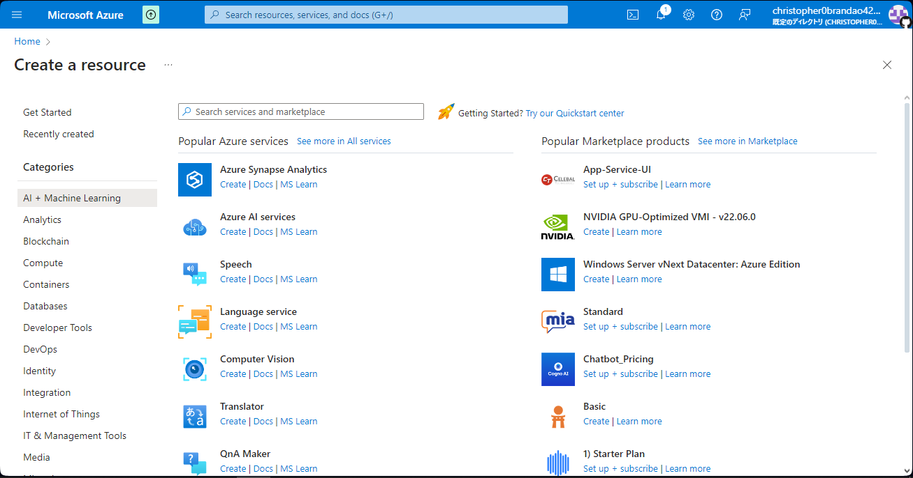
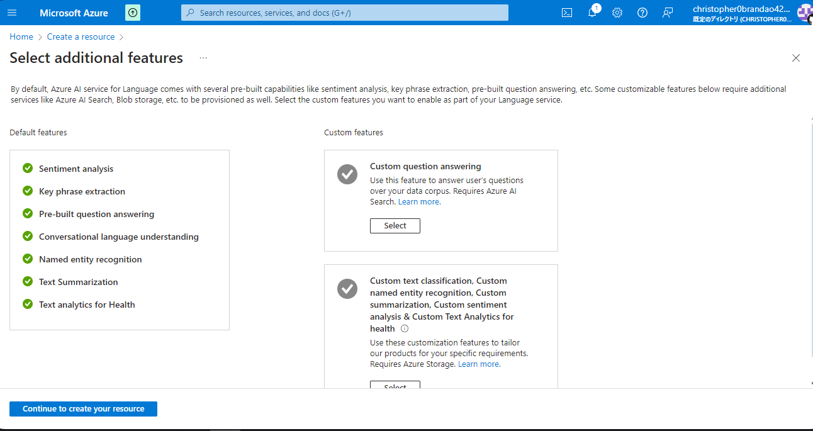
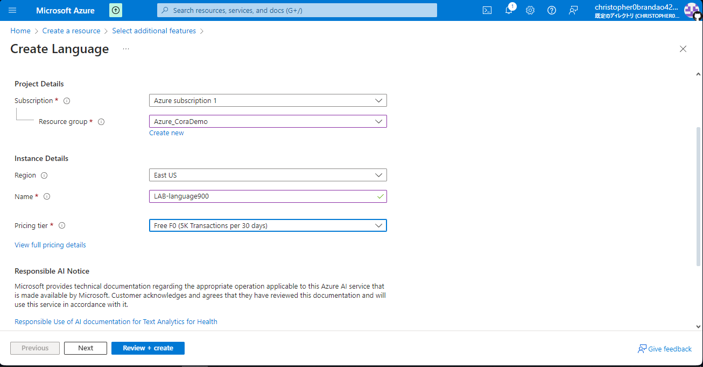
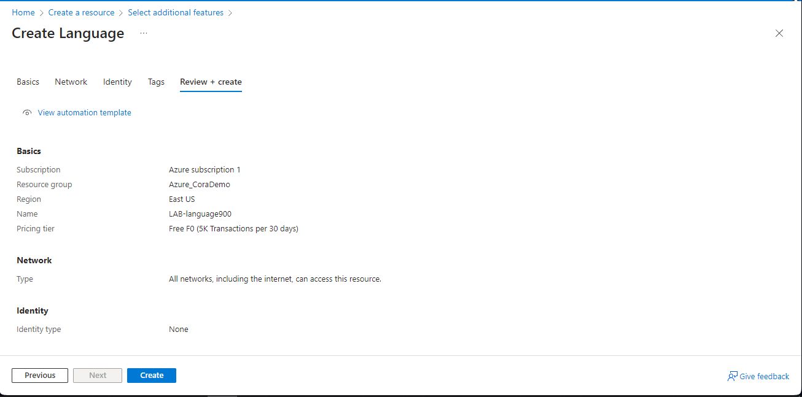
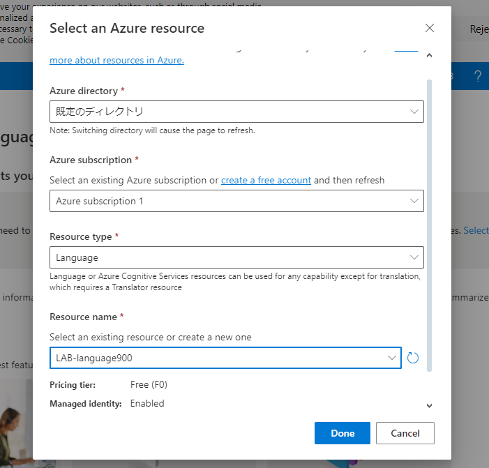
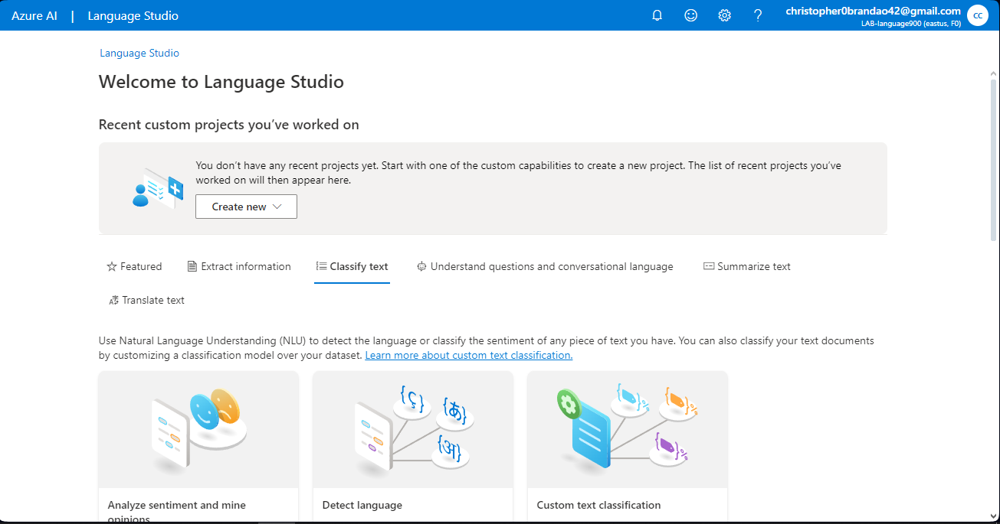
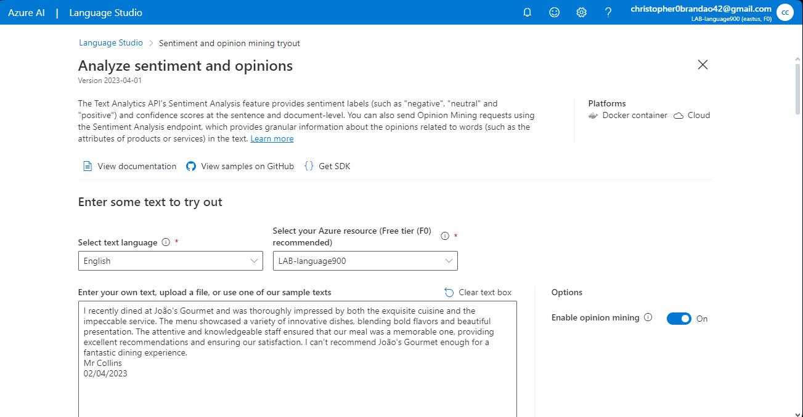
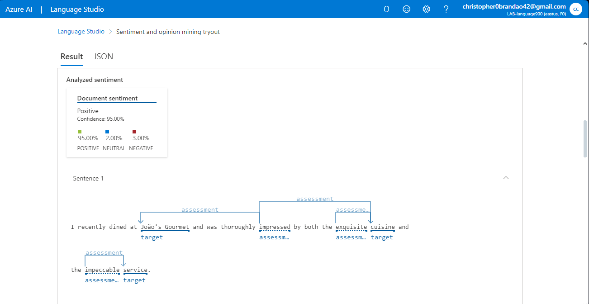

# dio_challenges_azure_speech
Project made during DIO's "Microsoft Azure AI Fundamentals" Bootcamp, under the section "Análise de Sentimentos com Language Studio no Azure AI"

Reference links:

- [Analyze text with Language Studio](https://microsoftlearning.github.io/mslearn-ai-fundamentals/Instructions/Labs/06-text-analysis.html)

## Followed step by step:

1. Access Azure Portal then click on "Create a resource"
2. Search for "Language service"

3. Under resource's name, click on "Create resource" then click on "Continue to create your resource"

  
4. Fill the necessary fields then click on "Review + create"

5. Wait for the validation process; after finished validation with no errors returned, click on "Create"

6. After finishing the deployment process, click on "Go to resource group"
7. After checking if resource was deployed, go to language.cognitive.azure.com
8. When accessing the site, you'll be asked to select resource. Fill in the fields and click on "Done"

9. On Language Studio's home page, click on "Classify text" then click on "Analyze sentiment and mine opinions"

10. Select language, input text or text file and check the acknowledge box; finally, click on "Run"

Here is the output to te sample input:

**Noted points:** This resource and other Language Studio resources can be used in various environments, also you can use the code in your own environment; more info at tht end of the page

